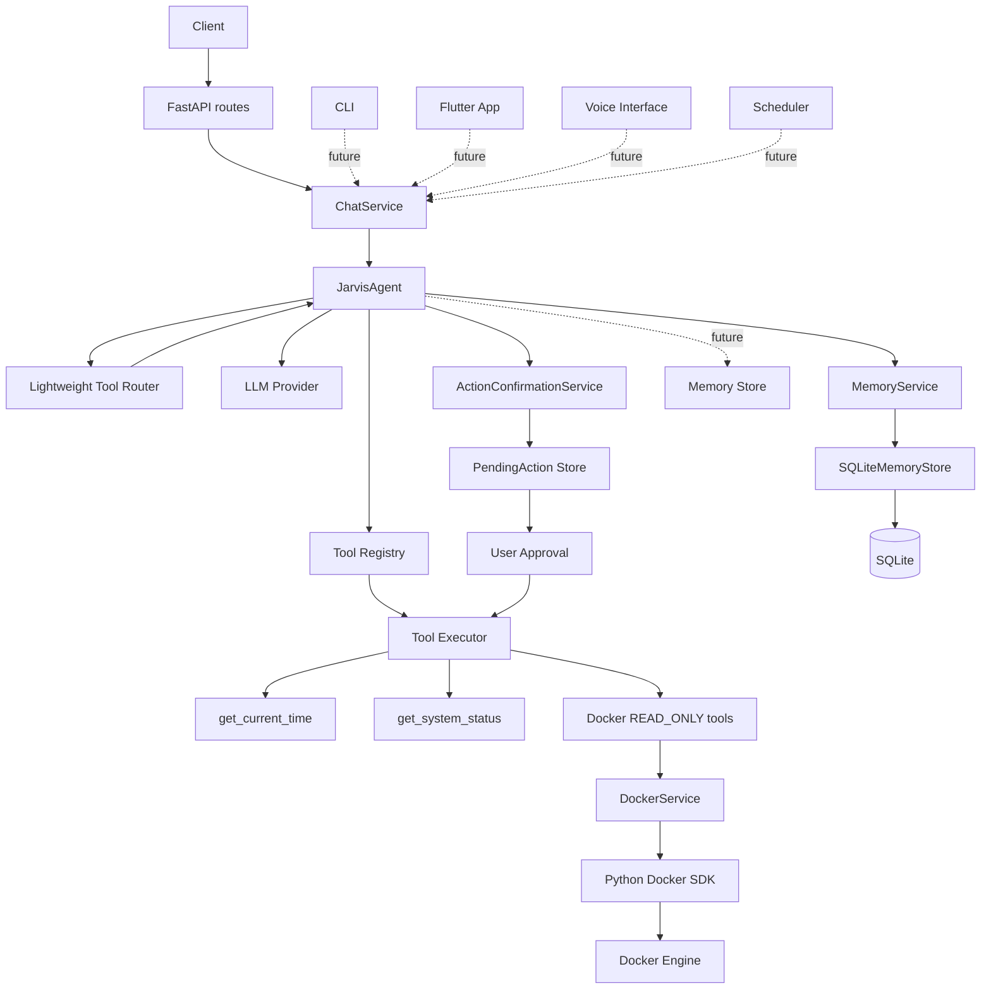

# Architecture

JARVIS separates delivery interfaces from its core so a future CLI, Flutter app,
voice interface, scheduler, and automation engine can share the same application
services without embedding business logic in their transport layer.

## Layers

- **Interface:** FastAPI validates HTTP requests and serializes responses only.
- **Application:** `ChatService` coordinates a use case.
- **Core:** `JarvisAgent` owns conversation assembly, bounded tool orchestration, and provider interaction. `ToolRouter` selects `NONE` or one Registry capability without creating arguments or executing tools. The main LLM receives either no schemas or the selected schema, then native Tool Calling continues through the executor.
- **Provider:** `LLMProvider` exposes common `LLMResponse` and `LLMToolCall` models. `MockLLMProvider` is offline; `OpenAICompatibleProvider` isolates HTTP/API-specific parsing.
- **Capabilities:** `ToolRegistry` owns discovery. `ToolExecutor` validates arguments, permits READ_ONLY tools only, logs execution, and converts failures to safe structured results. LLM, Tool, and Memory contracts can change implementations without coupling routes or the agent to vendor SDKs or databases.
- **Infrastructure:** configuration, logging, Docker, and deployment concerns.

## Security boundary

The LLM never executes tools directly. Every call passes through Registry lookup, argument validation, and safety enforcement. v0.3 Docker tools are READ_ONLY only: list containers, inspect one container, and retrieve bounded logs. v0.3.5 adds a generic in-memory `PendingAction` lifecycle: WRITE calls become pending, require explicit user approval, receive a runtime-only one-shot authorization, and return to the same ToolExecutor. DANGEROUS tools are always rejected. v0.4 adds `MemoryService -> SQLiteMemoryStore -> SQLite` for explicit long-term user context. Memory is not conversation history, PendingAction state, or system instruction; it cannot alter safety policy. Docker SDK failures become safe ToolResults; raw logs are not written to application logs. No Docker CLI, subprocess, shell, stop, remove, or exec operation exists. Secrets belong in environment settings and must never be logged.

v0.4.5 adds a lock-protected in-memory `ConversationStore` isolated by
`conversation_id`. Recent context is bounded by message count and character
count and is not persisted to SQLite. System instructions, long-term memory,
recent conversation, and the current user message are kept distinct. Tool
protocol messages remain request-local, and conversation content cannot override
runtime safety enforcement.

v0.4.7 adds a Daily Tools branch: `WeatherService` resolves locations through
`OpenMeteoProvider`, then exposes bounded READ_ONLY current and forecast tools.
The provider is isolated from tool definitions and translates network/API
failures into safe `ToolResult` errors. Open-Meteo is the weather data source.

v0.4.6 centralizes persona behavior in `app/agent/prompt.py`. The prompt
defines identity, casual versus technical response style, memory/context
boundaries, and the policy for current information. It guides language-model
behavior only; ToolExecutor and ActionConfirmation remain the authoritative
runtime safety layers.

v0.4.7.1 extends the provider boundary with optional `LLMUsage` and
`LLMRateLimitInfo` metadata. HTTP 429 responses map to
`LLMRateLimitError` without automatic retry. Logs contain only model/provider,
token counts, rate-limit counters, and context/tool sizes; raw prompts,
conversation, memory, tool results, authorization headers, and API keys are
never logged.

v0.4.9 adds an optional, best-effort Adaptive Memory Curator. It classifies durable non-sensitive preferences and project/environment context through the existing provider, while MemoryService remains the only writer. Explicit memory commands take precedence and adaptive memory cannot override safety or authorization.
Routing hints are
owned by `ToolRegistry`; invalid or unknown decisions fall back to a no-tool
conversation. Candidate filtering is capability selection, not authorization:
READ_ONLY execution, WRITE confirmation, and DANGEROUS blocking remain in the
runtime safety layers.

v0.5.0 adds an independent local speech-input boundary: multipart audio is
sent to `/api/stt/transcribe`, then processed by `STTService` and a lazy
`FasterWhisperProvider`. CPU inference runs off the event loop, with bounded
size, timeout, concurrency, and temporary-file cleanup. Transcripts are not
automatically sent to Chat, tools, or persistent memory; microphone capture,
TTS, wake word, and voice authentication remain outside this version.

v0.5.1 adds a separate text-to-audio boundary:
`text -> /api/tts/synthesize -> TTSService -> TTSProvider -> sherpa-onnx Supertonic 3 -> WAV`.
The model is loaded lazily on CPU, synthesis runs outside the event loop, and
the endpoint has no conversation, memory, tool, or authorization side effects.
The official Supertonic artifact is OpenRAIL-M licensed; voice cloning and
server-side speaker playback are not part of this version.
The deployment model directory is `data/models/tts/supertonic-3` and is kept
outside Git.

v0.5.2 adds an out-of-process PC client and keeps the Core boundary HTTP-only:
`PC microphone/file -> /api/stt/transcribe -> transcript -> /api/chat ->
assistant text -> /api/tts/synthesize -> WAV -> optional local playback`.
